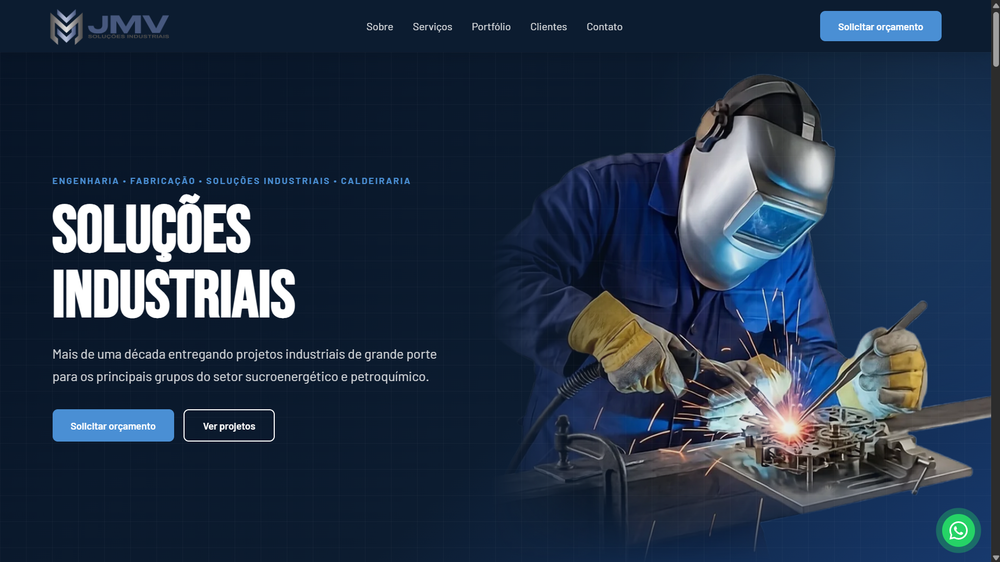

# JMV Engenharia e Construções — Site Institucional

Site institucional da **JMV Engenharia e Construções**, empresa de montagem industrial, caldeiraria, estruturas metálicas e manutenção para os setores sucroenergético e petroquímico.

🌐 **Ao vivo:** [site-jmv.vercel.app](https://site-jmv.vercel.app)

---

## Sobre este projeto

Projeto real, entregue para uma empresa em produção — desenvolvido do zero como estudo de caso de um site institucional **rápido, seguro e sustentável de manter**. O foco não foi só "fazer uma landing page bonita", e sim aplicar as práticas que separam um site de portfólio de um produto de verdade:

- **Testes automatizados + CI** rodando a cada push
- **Backend endurecido** (blindagem da API de contato contra abuso e injeção)
- **SEO técnico** com structured data (JSON-LD)
- **LGPD** (consentimento e política de privacidade)
- **Acessibilidade** (foco visível, `aria-live`, elementos semânticos)
- **CMS headless** para o cliente editar conteúdo sem depender de deploy

O código é público de propósito — este README é a leitura principal para entender **as decisões** por trás do projeto.

---

## Capturas de tela

> _(a adicionar)_ Screenshots do site em produção — coloque as imagens em `docs/screenshots/` e referencie aqui.

<!--
Sugestão de capturas:
- hero.png        → topo/hero da home
- portfolio.png   → slideshow ou grade de portfólio
- contato.png     → formulário de contato
- mobile.png      → visão responsiva no celular

Exemplo de embed:

-->

---

## Performance (Lighthouse)

> _(a preencher)_ Rode uma auditoria Lighthouse em produção (DevTools → Lighthouse, ou `npx lighthouse https://site-jmv.vercel.app`) e registre os números:

| Métrica | Score |
|---|---|
| Performance | — |
| Acessibilidade | — |
| Boas práticas | — |
| SEO | — |

Build de produção: **~402 módulos**, CSS final **29 kB (6,3 kB gzip)**, chunks separados para React, Framer Motion e Lucide.

---

## Stack

| Camada | Tecnologia |
|---|---|
| UI | React 19 + Vite 8 |
| Roteamento | React Router DOM 7 |
| Animações | Framer Motion 12 |
| Ícones | Lucide React |
| Estilo | CSS puro, co-localizado por componente |
| CMS | Sanity (headless) — conteúdo do portfólio |
| Rate limiting | @upstash/ratelimit + Vercel KV |
| Anti-bot | Cloudflare Turnstile (CAPTCHA invisível) |
| Testes | Vitest 4 + Testing Library |
| Linting | ESLint 10 |
| E-mail | Resend (Vercel Serverless Function) |
| Deploy | Vercel |
| Analytics | Vercel Analytics + Speed Insights |

---

## Destaques técnicos (as decisões)

### 1. Segurança real na API de contato
O endpoint `api/contact.js` (Serverless Function) foi endurecido além do trivial:
- **Honeypot validado no servidor** — o campo isca é checado no backend, não só no cliente (bypass via POST direto não passa).
- **Rate limiting persistente** por IP com janela deslizante (`@upstash/ratelimit` + **Vercel KV**), compartilhado entre todas as instâncias serverless — com fallback in-memory quando o KV não está configurado (dev/testes).
- **Limites de tamanho** server-side em todos os campos.
- **Sanitização anti-injeção** de quebras de linha no `subject` (evita header injection de e-mail).
- **Checagem de origem** (`Origin` vs. host), agnóstica ao domínio.
- **CAPTCHA invisível** (Cloudflare Turnstile) verificado no servidor — barra bots sem atrito para o usuário; desativa-se sozinho se as chaves não estiverem configuradas.

**Por quê:** um formulário público é a superfície de ataque mais óbvia de um site institucional. Validar só no front é teatro de segurança. E rate limiting in-memory não basta em serverless — a memória é por instância e some no cold start; por isso o estado do limitador vive no KV.

### 2. CMS headless com fallback (Sanity)
O portfólio deixou de ser hardcoded em `src/data/` e passou a ser gerenciado no **Sanity Studio** — o cliente adiciona/edita projetos e imagens sem tocar em código nem esperar deploy.

A integração tem um **fallback automático**: se o CMS não estiver configurado (ou a busca falhar), o site volta a servir os dados locais. Isso permitiu migrar de forma incremental sem nunca quebrar a produção. As imagens vêm otimizadas (WebP) pela CDN do Sanity via `@sanity/image-url`.

**Por quê:** conteúdo hardcoded trava a entrega para clientes não-técnicos. Um CMS é o que separa "faço sites" de "entrego um produto que o cliente opera sozinho".

### 3. CSS co-localizado por componente
O `globals.css` monolítico (2291 linhas) foi dividido em um `base.css` global + um CSS por componente/página, importado dentro do próprio `.jsx`. Estilos compartilhados são resolvidos por `import` (o Vite deduplica — sem duplicação no bundle).

**Por quê:** um CSS global cresce até virar um campo minado de colisões. Co-localizar mantém cada estilo perto de quem o usa e torna a manutenção previsível.

### 4. SEO técnico e structured data
`useSEO` centraliza título/description/canonical por página e injeta **JSON-LD** (Organization, FAQPage, BreadcrumbList) sincronizado com o texto visível. `BASE_URL` elimina URLs duplicadas espalhadas pelo código.

**Por quê:** para um site que depende de ser achado no Google por buscas locais/técnicas, structured data melhora a elegibilidade a rich results e Knowledge Panel.

### 5. Testes + CI como rede de segurança
**109 testes** (19 arquivos) cobrindo componentes, hooks, páginas, dados e a **API de contato** (método, origem, honeypot, tamanho, sanitização, rate limit, sucesso e falha). O CI (GitHub Actions) roda lint + testes + build a cada push.

**Por quê:** testes não são burocracia — são o que permite refatorar (ex.: a migração para o CMS) com confiança de que nada quebrou.

---

## Funcionalidades

- Landing page responsiva (mobile, tablet, desktop) com animações ao rolar
- Portfólio: slideshow na home + página completa com filtro por categoria (**gerenciado via CMS**)
- Formulário de contato com validação e envio por API (Resend)
- Banner de consentimento de cookies + Política de Privacidade (LGPD)
- SEO: meta tags, Open Graph, Twitter Card e JSON-LD
- PWA básico (`manifest.json`), `noscript`, botão flutuante de WhatsApp e voltar ao topo
- Página 404 personalizada

---

## Estrutura do Projeto

```
jmv-site/
├── api/
│   └── contact.js           # Serverless Function — envio de e-mail (Resend) endurecido
├── scripts/
│   ├── optimize-images.js   # Otimização de imagens (Sharp)
│   └── seed-sanity.mjs       # Popula o portfólio no Sanity (idempotente)
├── studio/                   # Sanity Studio (CMS) — schema, config
├── src/
│   ├── assets/              # Imagens e logos (WebP)
│   ├── components/          # Componentes + CSS co-localizado
│   ├── data/                # Dados estáticos (fallback do portfólio)
│   ├── hooks/               # useSEO, usePageTracking, useCountUp, useProjects
│   ├── lib/                 # sanity.js (client + urlFor)
│   ├── pages/               # PortfolioPage, PrivacidadePage, NotFoundPage
│   ├── styles/              # base.css global
│   ├── test/                # Testes (Vitest + Testing Library)
│   └── utils/               # scrollToSection, genId
├── .env.example
├── .github/workflows/ci.yml # Pipeline de CI (lint + test + build)
├── vercel.json
└── vite.config.js
```

---

## Variáveis de Ambiente

Crie um `.env.local` (site) com base no `.env.example`:

```env
VITE_GA_MEASUREMENT_ID=G-XXXXXXXXXX   # Google Analytics (opcional)
RESEND_API_KEY=re_xxxxxxxxxxxxxxxxxxxx # Formulário de contato

# CMS Sanity — sem estas variáveis, o site usa os dados locais (fallback)
VITE_SANITY_PROJECT_ID=xxxxxxxx
VITE_SANITY_DATASET=production
```

> O Studio (`studio/`) tem seu próprio setup — ver [`studio/README.md`](./studio/README.md).

---

## Instalação e Execução

**Pré-requisitos:** Node.js 22+

```bash
git clone https://github.com/Vinicius-Santos234/Site-JMV.git
cd Site-JMV
npm install
cp .env.example .env.local   # edite com suas chaves
npm run dev
```

Disponível em `http://localhost:5173`.

---

## Scripts Disponíveis

```bash
npm run dev          # Servidor de desenvolvimento
npm run build        # Build de produção
npm run preview      # Preview do build local
npm run lint         # ESLint
npm run test         # Testes em modo watch
npm run test:run     # Testes em modo CI
npm run test:coverage # Relatório de cobertura
```

---

## Testes

**109 testes** em 19 arquivos, cobrindo componentes, hooks, páginas, dados e a API de contato.

```bash
npm run test:run
```

Áreas cobertas:
- **Componentes:** `Contact`, `CookieBanner`, `FAQ`, `FadeInSection`, `FloatingButtons`, `Portfolio`, `Quality`, `Services`, `Stats`, `Testimonials`
- **Hooks:** `useSEO`, `usePageTracking`, `useCountUp`
- **Páginas:** `NotFoundPage`, `PortfolioPage`, `PrivacidadePage`
- **API:** `contact` (origem, honeypot, tamanho, sanitização, rate limit, CAPTCHA, sucesso/erro)
- **Dados:** `services`, `stats`

---

## CI/CD

Pipeline no GitHub Actions a cada push/PR para `main`: **Lint → Testes → Build**. O deploy em produção é automático pela Vercel após o merge em `main`.

---

## Depoimento

> _(a adicionar)_ Depoimento do cliente sobre o processo e o resultado.

---

## Contato

**JMV Engenharia e Construções**
(16) 99741-8402 · jpsantos@jmv.ind.br · Matão — SP

---

## Autor

Desenvolvido por **Vinicius Santos**.

Código-fonte sob licença [MIT](./LICENSE). Identidade visual, conteúdo e imagens são de propriedade da JMV Engenharia e Construções.
