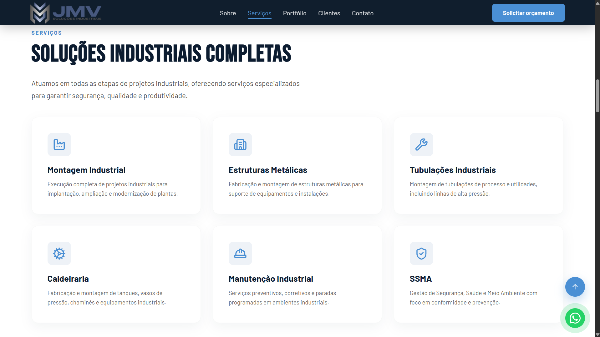
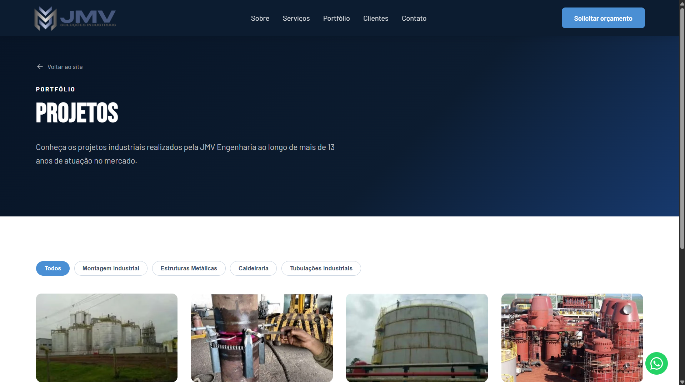
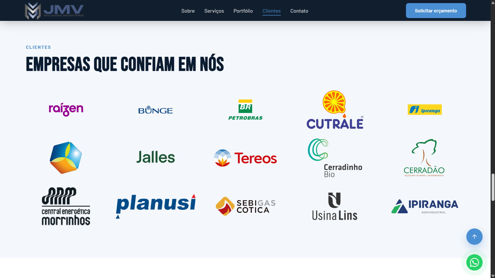
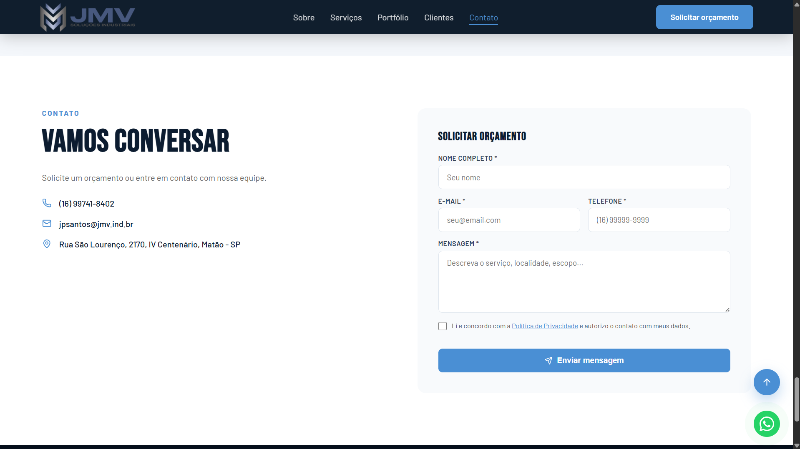

# JMV Soluções Industriais — Site Institucional

Site institucional da **JMV Soluções Industriais**, empresa de montagem industrial, caldeiraria, estruturas metálicas e manutenção para os setores sucroenergético e petroquímico.

🌐 **Ao vivo:** [site-jmv.vercel.app](https://site-jmv.vercel.app)

---

## Sobre este projeto

Projeto real, entregue para uma empresa em produção — desenvolvido do zero como estudo de caso de um site institucional **rápido, seguro e sustentável de manter**. O foco não foi só "fazer uma landing page bonita", e sim aplicar as práticas que separam um site de portfólio de um produto de verdade:

- **Testes automatizados + CI** rodando a cada push
- **Backend endurecido** (blindagem da API de contato contra abuso e injeção)
- **Performance** otimizada no caminho de renderização (LCP, fontes, imagens)
- **SEO técnico** com structured data (JSON-LD)
- **LGPD** (consentimento e política de privacidade)
- **Acessibilidade** (foco visível, `aria-live`, elementos semânticos)
- **CMS headless** para o cliente editar conteúdo sem depender de deploy

O código é público de propósito — este README é a leitura principal para entender **as decisões** por trás do projeto.

---

## Capturas de tela







---

## Performance (Lighthouse)

Medido em produção, mobile com throttling, Lighthouse 13.4.1 (11/09/2026):

| Métrica | `/` | `/portfolio` |
|---|---|---|
| Performance | 88 | 89 |
| Acessibilidade | 95 | 95 |
| Boas práticas | 100 | 100 |
| SEO | 100 | 100 |

### Antes e depois da migração, medidos juntos

Comparar com um score antigo **não funciona**: versões diferentes do Lighthouse
pontuam de formas diferentes, e o mesmo build que marcava 89 em julho marca 77
com a v13. Para medir o efeito da migração, os dois builds foram servidos lado a
lado na mesma máquina, com a mesma versão, 3 execuções cada:

| | Vite (`03f90e1`) | Next (`fdc1eb5`) |
|---|---|---|
| **Performance** | 76–78 | **82–85** |
| FCP | 2,4 s | **1,7 s** |
| LCP | 4,8 s | **4,1 s** |
| TBT | 134–204 ms | 120–150 ms |
| Speed Index | 2,5 s | 2,6 s |
| CLS | 0 | 0 |

A migração vale **~6 pontos**, vindos de FCP e LCP: o HTML já chega pintável, em
vez de esperar o bundle React montar a página.

> **O que não aconteceu:** o salto grande que se poderia esperar de sair do CSR.
> O SSG conserta o **FCP**, que pesa 10% do score, enquanto a hidratação do
> payload RSC piora um pouco o **TBT**, que pesa 30%. Sair do CSR não sobe o
> placar sozinho — troca uma métrica leve por uma pesada.
>
> Hoje o maior custo de main-thread nem é JavaScript: **Style & Layout com
> ~859 ms**, contra ~490 ms de execução de script. O próximo alvo de performance
> é o CSS, não o bundle.

**Otimizações do caminho de renderização** (detalhes em [Destaques técnicos #6](#6-performance-atacando-o-caminho-de-renderização)):

- **Renderização estática (SSG)** com revalidação de 1 h — o HTML sai pronto, com o conteúdo do CMS dentro.
- **Imagem LCP com `priority`** (`next/image`) — emite o preload que antes era escrito à mão no `index.html`.
- **Fontes self-hosted** com `font-display: swap` — elimina o request render-blocking do Google Fonts.
- **Imagens otimizadas** por `next/image` (AVIF/WebP, resize responsivo), inclusive as que vêm da CDN do Sanity.
- **Scripts de terceiros sob demanda** — o CAPTCHA só carrega quando o formulário se aproxima da viewport.

---

## Stack

| Camada | Tecnologia |
|---|---|
| UI | React 19 + Next.js 16 (App Router) |
| Renderização | Estática (SSG) com revalidação de 1h |
| Roteamento | App Router (por pasta) |
| Animações | Framer Motion 12 |
| Ícones | Lucide React |
| Estilo | CSS puro, co-localizado por componente |
| CMS | Sanity (headless) — conteúdo do portfólio |
| Rate limiting | Regra do Vercel Firewall, na borda |
| Anti-bot | Cloudflare Turnstile (carregado sob demanda) |
| Fontes | Self-hosted (WebFont `.woff2`, `font-display: swap`) |
| Testes | Vitest 4 + Testing Library |
| Linting | ESLint 10 |
| E-mail | Resend (Route Handler) |
| Deploy | Vercel |
| Analytics | Vercel Analytics + Speed Insights |

---

## Destaques técnicos (as decisões)

### 1. Segurança real na API de contato
O endpoint `src/app/api/contact/route.js` (Route Handler) foi endurecido além do trivial:
- **Honeypot validado no servidor** — o campo isca é checado no backend, não só no cliente (bypass via POST direto não passa).
- **Rate limiting na borda** — regra do Vercel Firewall (5 req/600s por IP em `POST /api/contact`), aplicada antes de a requisição chegar à função. Sem banco e sem estado que expire. Ver [Rate limiting](#rate-limiting).
- **Limites de tamanho** server-side em todos os campos.
- **Sanitização anti-injeção** de quebras de linha no `subject` (evita header injection de e-mail).
- **Checagem de origem** (`Origin` vs. host), agnóstica ao domínio.
- **CAPTCHA invisível** (Cloudflare Turnstile) verificado no servidor — barra bots sem atrito para o usuário. Em desenvolvimento ele se desliga sem as chaves; **em produção, chave ausente é erro, não modo degradado** (ver abaixo).
- **Validação de tipo antes de validação de conteúdo** — um corpo como `{"nome": 123}` fazia `.trim()` lançar antes de chegar ao rate limit e ao CAPTCHA.
- **Falha de envio nunca vira sucesso** — o SDK do Resend não lança em erro de API, devolve `{ data, error }`. Sem checar isso, chave inválida respondia "enviado com sucesso" e o orçamento sumia.

**Por quê:** um formulário público é a superfície de ataque mais óbvia de um site institucional. Validar só no front é teatro de segurança.

> **A lição mais cara do projeto, em 09/2026:** defesa que degrada em silêncio para de proteger sem avisar. O rate limiting ficou **semanas sem efeito** porque o banco do Upstash foi removido por inatividade e o código caiu no fallback em memória — nada quebrou, o site seguiu respondendo 200. O mesmo padrão existia no CAPTCHA, que se desligava sozinho sem o segredo. Hoje: o limite vive na borda (sem estado para expirar) e o CAPTCHA recusa em produção em vez de liberar.

### 2. CMS headless com fallback (Sanity)
O portfólio deixou de ser hardcoded em `src/data/` e passou a ser gerenciado no **Sanity Studio** — o cliente adiciona/edita projetos e imagens sem tocar em código nem esperar deploy.

A integração tem um **fallback automático**: se o CMS não estiver configurado (ou a busca falhar), o site volta a servir os dados locais. Isso permitiu migrar de forma incremental sem nunca quebrar a produção. As imagens vêm otimizadas (WebP) pela CDN do Sanity via `@sanity/image-url`.

**Por quê:** conteúdo hardcoded trava a entrega para clientes não-técnicos. Um CMS é o que separa "faço sites" de "entrego um produto que o cliente opera sozinho".

### 3. CSS co-localizado por componente
O `globals.css` monolítico (2291 linhas) foi dividido em um `base.css` global + um CSS por componente/página, importado dentro do próprio `.jsx`. Estilos compartilhados são resolvidos por `import` (o bundler deduplica). O cabeçalho comum de `/portfolio` e `/privacidade` vive em `src/styles/page-header.css`, importado pelas duas.

**Por quê:** um CSS global cresce até virar um campo minado de colisões. Co-localizar mantém cada estilo perto de quem o usa e torna a manutenção previsível.

### 4. SEO técnico e structured data
Cada rota exporta sua própria `metadata` (título, description, canonical, Open Graph, Twitter), que o Next escreve **no HTML servido** — antes de qualquer JavaScript. O **JSON-LD** (GeneralContractor, FAQPage, BreadcrumbList) é renderizado pelo componente `JsonLd`, a partir da mesma lista que a página exibe.

> **Por que isto mudou.** Até 09/2026 o site era uma SPA que trocava as metas num `useEffect`. Funcionava no navegador e **não existia para o crawler de link**: WhatsApp, LinkedIn e Facebook não executam JS, então `/portfolio` e `/privacidade` eram servidas com a metadata da home — as quatro URLs devolviam HTML byte a byte idêntico, com `canonical` apontando para `/` em todas. Medido por `curl` e corrigido pela migração para o Next.

**Por quê:** para um site que depende de ser achado no Google por buscas locais/técnicas, structured data melhora a elegibilidade a rich results e Knowledge Panel.

### 5. Testes + CI como rede de segurança
**106 testes** (19 arquivos) cobrindo componentes, páginas, dados e a **API de contato** (método, origem, honeypot, tipos, tamanho, sanitização, rate limit, recusa do provedor, sucesso e falha). O CI (GitHub Actions) roda lint + testes + build a cada push.

**Por quê:** testes não são burocracia — são o que permite refatorar (ex.: a migração para o CMS) com confiança de que nada quebrou.

E eles pegam o que revisão não pega: no conserto do escape de JSON-LD, uma barra invertida a menos fazia `"<"` virar o próprio `<`, e o replace virava um no-op perfeitamente silencioso. O diff parecia certo; só o teste reprovou.

### 6. Performance: atacando o caminho de renderização
Numa SPA, o gargalo raramente é "código pesado" — o relatório mostrava `TBT` e `CLS` perfeitos, mas `FCP`/`LCP` altos. O HTML inicial é um `<div id="root">` vazio, então nada pinta até o bundle baixar, parsear e renderizar. As correções miram **quando** o navegador descobre e baixa os recursos críticos:

- **Imagem LCP descobrível:** o herói é servido de `/public` com `priority` no `next/image`, que emite o preload. Antes da rodada de otimização, sendo importada pelo React, ela só era requisitada **depois** de ~130 kB de JS.
- **Fontes self-hosted:** os `.woff2` são servidos do próprio domínio (`/fonts`), declarados via `@font-face` com `font-display: swap`. Elimina o `<link>` render-blocking para o Google Fonts — que, com o CSP restritivo do projeto (`script-src` sem `'unsafe-inline'`), não podia ser contornado pelo truque de `onload` inline.
- **Imagens no tamanho certo:** redimensionadas com **Sharp** para ~2× as dimensões de exibição (retina), com `width`/`height` explícitos para não gerar layout shift.
- **Terceiros sob demanda:** o Cloudflare Turnstile carregava centenas de kB de challenge no load inicial; passou a montar via `IntersectionObserver` só quando a seção de contato se aproxima — o token fica pronto antes do envio, sem custo na primeira pintura.
- **Framer Motion enxuto:** migrado para `LazyMotion` + `m` (em vez de `motion`), carregando só as features de animação realmente usadas (`domAnimation`). O chunk de animação caiu de ~132 kB para ~86 kB.

**Por quê:** FCP e LCP dependem do *critical rendering path*, não de quanta CPU o JS gasta. Preload da imagem certa e fontes locais movem a agulha muito mais do que microtuning de JavaScript.

**A correção que a migração trouxe a esse raciocínio (09/2026):** "o score é dominado por FCP/LCP" está errado como regra geral. Na ponderação atual do Lighthouse, **TBT pesa 30% e FCP pesa 10%** — o caminho de renderização domina enquanto ele é o gargalo, e deixa de dominar quando você o conserta. Foi o que aconteceu ao sair do CSR: FCP melhorou muito, TBT piorou um pouco, e o score andou menos do que a diferença de experiência sugere.

---

## Funcionalidades

- Landing page responsiva (mobile, tablet, desktop) com animações ao rolar
- Portfólio: slideshow na home + página completa com filtro por categoria (**gerenciado via CMS**)
- Formulário de contato com validação e envio por API (Resend)
- Banner de consentimento de cookies + Política de Privacidade (LGPD)
- SEO: meta tags, Open Graph, Twitter Card e JSON-LD
- PWA básico (`manifest.json`), `noscript`, botão flutuante de WhatsApp e voltar ao topo
- Página 404 personalizada

---

## Estrutura do Projeto

```
jmv-site/
├── scripts/
│   ├── optimize-images.js   # Otimização de imagens (Sharp)
│   └── seed-sanity.mjs      # Popula o conteúdo no Sanity (idempotente)
├── studio/                  # Sanity Studio (CMS) — schema, config
├── public/
│   ├── fonts/               # Fontes self-hosted (.woff2)
│   └── welder.webp          # Imagem LCP (next/image com priority)
├── src/
│   ├── app/                 # App Router — uma pasta por rota
│   │   ├── layout.jsx       # Layout raiz + metadata base + JSON-LD do negócio
│   │   ├── template.jsx     # Transição de entrada entre rotas
│   │   ├── page.jsx         # Home (Server Component, busca o conteúdo)
│   │   ├── not-found.jsx    # 404 de verdade (HTTP 404, não soft 404)
│   │   ├── portfolio/       # /portfolio + metadata própria
│   │   ├── privacidade/     # /privacidade + metadata própria
│   │   └── api/contact/     # Route Handler — envio de e-mail (Resend)
│   ├── assets/              # Imagens e logos (WebP)
│   ├── components/          # Componentes + CSS co-localizado
│   ├── data/                # Dados estáticos (fallback do CMS)
│   ├── hooks/               # useCountUp
│   ├── lib/
│   │   ├── content.js       # Busca do CMS no servidor (server-only)
│   │   ├── sanity.js        # Client + urlFor
│   │   ├── seo.js           # BASE_URL, schemas e socialMetadata() por rota
│   │   └── api/             # rate-limit (canário), turnstile-verify
│   ├── styles/              # base.css global + page-header.css
│   ├── test/                # Testes (Vitest + Testing Library)
│   ├── utils/               # scrollToSection, genId
│   └── proxy.js             # Peneira de user-agent na borda (era middleware.js)
├── .env.example
├── .github/workflows/ci.yml # Pipeline de CI (lint + test + build)
├── jsconfig.json            # Alias @/ → src/
├── next.config.mjs          # Headers de segurança, CSP e imagens remotas
└── vitest.config.js
```

---

## Rate limiting

O limite do formulário é uma **regra do Vercel Firewall**, aplicada na borda:

```
contato-rate-limit — 5 requisições / 600s por IP, em POST /api/contact
```

Ela não vive neste repositório. Para ver ou alterar:

```bash
vercel firewall rules list
vercel firewall rules inspect contato-rate-limit
```

**Por que não é uma biblioteca.** Até 09/2026 o limite era `@upstash/ratelimit` +
Vercel KV. O banco do Upstash foi **removido por inatividade** — o site tem
pouco tráfego — e o código caiu no fallback em memória, que em serverless é por
instância e quase não limita. Nada quebrou: o site seguiu funcionando e
simplesmente parou de proteger, em silêncio, por semanas. A regra na borda não
tem estado para expirar.

`src/lib/api/rate-limit.js` continua existindo como **canário**: em operação
normal ele nunca dispara, porque a borda já barrou antes. Se disparar, é porque
a regra do firewall não pegou — e nesse caso ele grita no log em vez de degradar
calado, que foi o erro da vez anterior.

## Variáveis de Ambiente

Crie um `.env.local` (site) com base no `.env.example`:

```env
NEXT_PUBLIC_GA_MEASUREMENT_ID=G-XXXXXXXXXX   # Google Analytics (opcional)
RESEND_API_KEY=re_xxxxxxxxxxxxxxxxxxxx # Formulário de contato

# CMS Sanity — sem estas variáveis, o site usa os dados locais (fallback)
SANITY_PROJECT_ID=xxxxxxxx
SANITY_DATASET=production
```

> O Studio (`studio/`) tem seu próprio setup — ver [`studio/README.md`](./studio/README.md).

---

## Instalação e Execução

**Pré-requisitos:** Node.js 22+

```bash
git clone https://github.com/Vinicius-Santos234/Site-JMV.git
cd Site-JMV
npm install
cp .env.example .env.local   # edite com suas chaves
npm run dev
```

Disponível em `http://localhost:3000`.

---

## Scripts Disponíveis

```bash
npm run dev          # Servidor de desenvolvimento
npm run build        # Build de produção
npm run start        # Serve o build de produção localmente
npm run lint         # ESLint
npm run test         # Testes em modo watch
npm run test:run     # Testes em modo CI
npm run test:coverage # Relatório de cobertura
```

---

## Testes

**106 testes** em 19 arquivos, cobrindo componentes, páginas, dados e a API de contato.

```bash
npm run test:run
```

Áreas cobertas:
- **Componentes:** `Contact`, `CookieBanner`, `FAQ`, `FadeInSection`, `FloatingButtons`, `JsonLd` (escape de conteúdo do CMS), `Portfolio`, `PortfolioGrid`, `Quality`, `Services`, `Stats`, `Testimonials`
- **Hooks:** `useCountUp`
- **Páginas:** `not-found`, `/portfolio` (inclusive a metadata da rota), `/privacidade`
- **API:** `contact` (origem, honeypot, tipos, tamanho, sanitização, rate limit, CAPTCHA, recusa do provedor, sucesso/erro)
- **Dados:** `services`, `stats`

---

## CI/CD

Pipeline no GitHub Actions a cada push/PR para `main`: **Lint → Testes → Build**. O deploy em produção é automático pela Vercel após o merge em `main`.

---

## Depoimento

> _(a adicionar)_ Depoimento do cliente sobre o processo e o resultado.

---

## Contato

**JMV Soluções Industriais**
(16) 99741-8402 · jpsantos@jmv.ind.br · Matão — SP

---

## Licença

O **código-fonte** deste repositório está sob [MIT](LICENSE).

A licença **não** cobre a marca da JMV Soluções Industriais, os logotipos de
empresas terceiras em `src/assets/clients/` (marcas registradas de seus
titulares, exibidas como referência de clientes atendidos), nem as fotografias
de obras e os textos institucionais. Detalhes em [LICENSE](LICENSE).

## Autor

Desenvolvido por **Vinicius Santos**.

Código-fonte sob licença [MIT](./LICENSE). Identidade visual, conteúdo e imagens são de propriedade da JMV Soluções Industriais.
